# Lab 01: Create Azure AI Services and Explore Content Understanding

### Estimated Duration: 60 Minutes

## Overview

In this lab, you will explore the Azure resources that were pre-deployed for the document extraction pipeline, then manually create the **Azure AI Services** resource that powers Content Understanding — the core extraction engine of this solution. You will store its API key securely in Key Vault and connect it to the Azure AI Foundry workspace.

## Objectives

In this lab, you will complete the following tasks:

- Task 1: Explore pre-deployed Azure resources
- Task 2: Create an Azure AI Services resource
- Task 3: Store the AI Services key in Key Vault
- Task 4: Navigate Azure AI Foundry and explore the Content Understanding project

### Task 1: Explore pre-deployed Azure resources

In this task, you will navigate to the Azure Portal and review the resources that were automatically deployed for your lab environment.

1. In the Azure Portal, click on **Resource groups** **(1)** from the left navigation menu, then click on your resource group **<inject key="Resource Group Name" enableCopy="false" />** **(2)**.

   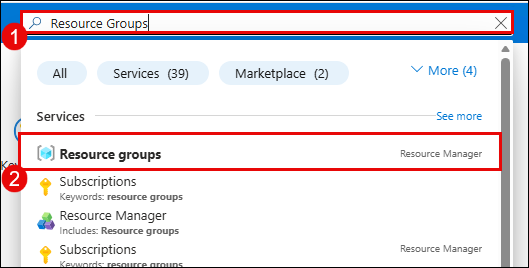

1. Review the list of deployed resources. You should see the following resources:

   | Resource Type | Name | Purpose |
   |---|---|---|
   | Key Vault | **devde<inject key="DeploymentID" enableCopy="false" />kv** | Stores API keys and connection strings |
   | Azure Cosmos DB (MongoDB) | **devde<inject key="DeploymentID" enableCopy="false" />cosmos** | Stores extraction configs and extracted data |
   | Azure Cosmos DB (SQL) | **devde<inject key="DeploymentID" enableCopy="false" />cosmoskb** | Stores chat history |
   | Azure OpenAI | **aoaidevde<inject key="DeploymentID" enableCopy="false" />** | Hosts the gpt-4o model |
   | Storage Account | **devde<inject key="DeploymentID" enableCopy="false" />sa** (with random suffix) | Stores processed documents |
   | Function App | **devde<inject key="DeploymentID" enableCopy="false" />func** (with random suffix) | Hosts the extraction API |
   | Application Insights | **devde<inject key="DeploymentID" enableCopy="false" />appins** | Monitoring and tracing |

   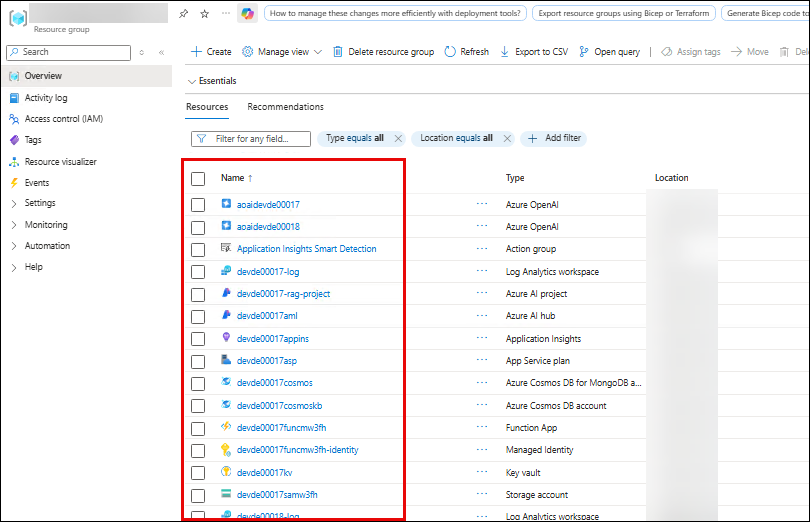

   >**Note:** The **Azure AI Services** resource is not yet deployed — you will create it manually in the next task. This is the core resource that powers Azure Content Understanding for document extraction.

1. Click on the **Key Vault** resource **devde<inject key="DeploymentID" enableCopy="false" />kv** **(1)**.

   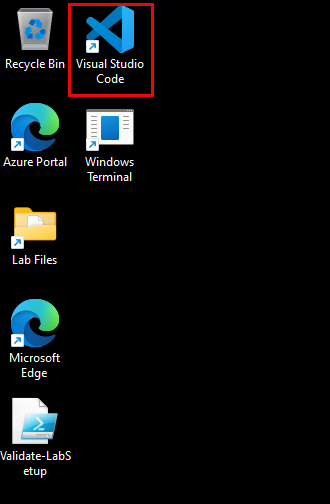

1. In the left menu, click on **Objects** **(1)** and then click **Secrets** **(2)**. Verify that two secrets are pre-populated:

   - **cosmosdb-connection-string** — Cosmos DB MongoDB connection string
   - **open-ai-key** — Azure OpenAI API key

   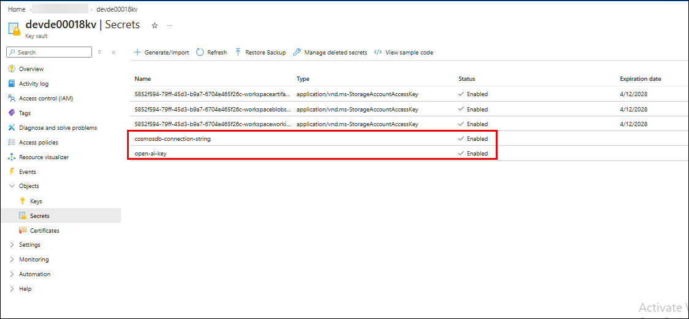

   >**Note:** You will add a third secret (**ai-foundry-key**) in Task 3 after creating the Azure AI Services resource.

1. Go back to the resource group. Click on the **Azure OpenAI** resource **aoaidevde<inject key="DeploymentID" enableCopy="false" />** **(1)**.

   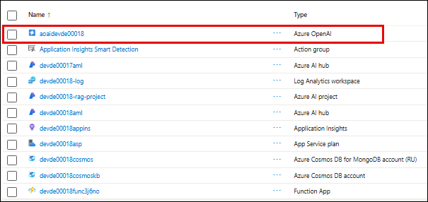

1. On the overview page, click **Go to Azure AI Foundry** **(1)**.

   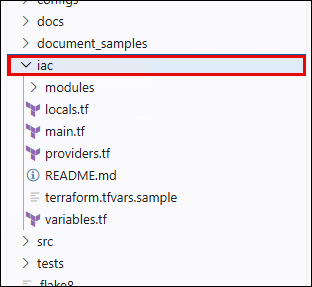

1. In Azure AI Foundry, navigate to **Deployments** **(1)** in the left menu. Verify that the **gpt-4o** **(2)** model is deployed with **Model version** 2024-08-06 and **Deployment type** Standard.

   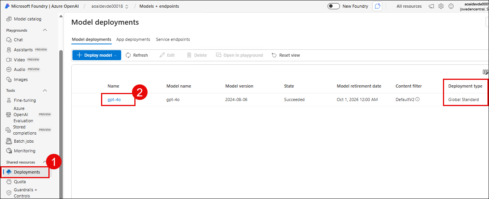

   >**Note:** This pre-deployed gpt-4o model powers the natural language query interface. When users ask questions about extracted document data, Semantic Kernel sends the query to this model along with the extracted fields as context.

### Task 2: Create an Azure AI Services resource

In this task, you will create the Azure AI Services resource that hosts Azure Content Understanding — the extraction engine that analyzes documents and extracts structured fields.

1. Go back to the Azure Portal. In the top search bar, type **AI Services** **(1)** and select **AI Services** **(2)** from the results.

   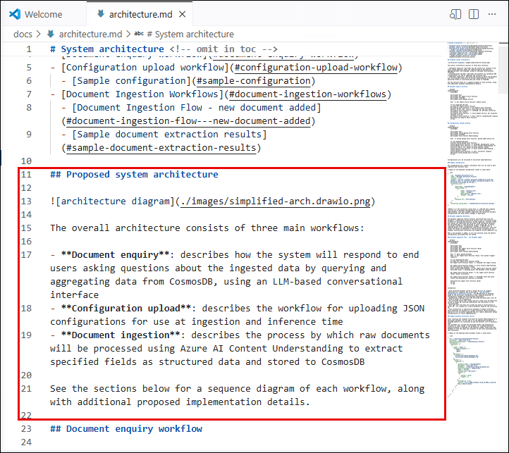

1. On the AI Services page, click **+ Create** **(1)**.

   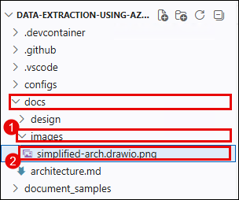

1. On the **Create AI Services** page, enter the following details:

   - **Subscription:** Select your subscription **(1)**
   - **Resource group:** Select **<inject key="Resource Group Name" enableCopy="false" />** **(2)**
   - **Region:** Select **Sweden Central** **(3)**
   - **Name:** Enter `devde<inject key="DeploymentID" enableCopy="true" />ais` **(4)**
   - **Pricing tier:** Select **Standard S0** **(5)**

   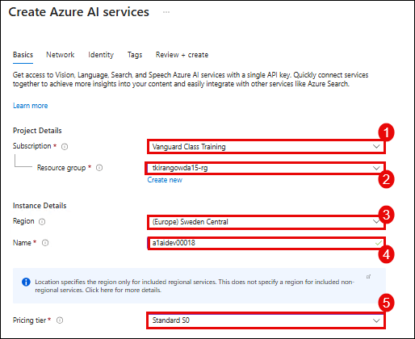

1. Check the **Responsible AI Notice** checkbox **(1)** and click **Review + create** **(2)**.

   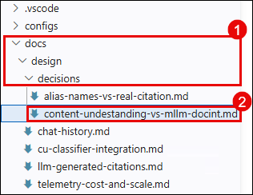

1. Review the summary and click **Create** **(1)**.

   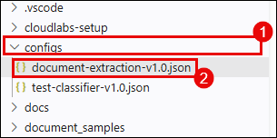

1. Wait for the deployment to complete. This takes approximately 1–2 minutes. Once completed, click **Go to resource** **(1)**.

   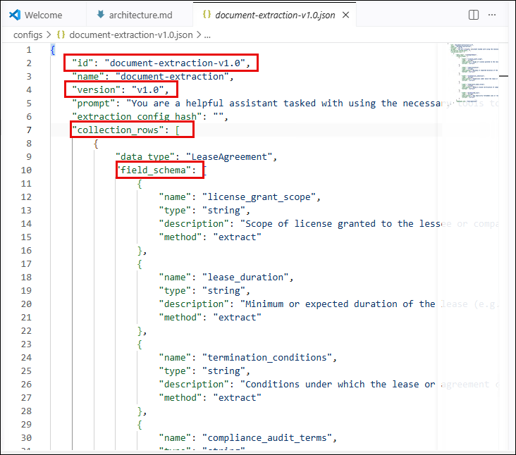

   >**Note:** Azure AI Services is a multi-service resource that provides access to several Azure AI capabilities including Content Understanding, Language, Vision, and Speech. In this lab, you will use the **Content Understanding** capability to extract structured data from documents.

1. On the AI Services overview page, expand **Resource Management** **(1)** in the left menu and click **Keys and Endpoint** **(2)**.

   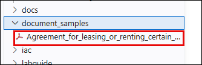

1. Copy the **KEY 1** **(1)** value and the **Endpoint** **(2)** URL — you will need both in the next task and in Lab 02.

   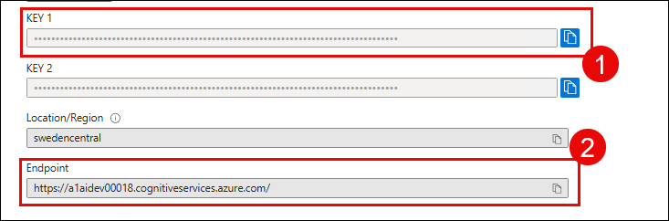

   >**Note:** Keep this tab open or save both values to a text file. You will need the endpoint URL (e.g., `https://devde<inject key="DeploymentID" enableCopy="false" />ais.cognitiveservices.azure.com/`) and the key in the upcoming tasks.

### Task 3: Store the AI Services key in Key Vault

In this task, you will store the AI Services API key as a secret in Azure Key Vault. The application retrieves this key at runtime from Key Vault, ensuring that API keys are never hardcoded in configuration files.

1. Go back to the resource group. Click on the **Key Vault** resource **devde<inject key="DeploymentID" enableCopy="false" />kv** **(1)**.

   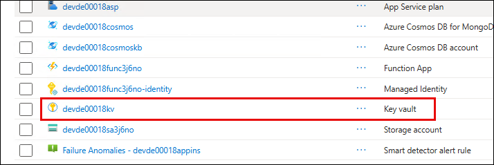

1. In the left menu, click on **Objects** **(1)** and then click **Secrets** **(2)**.

   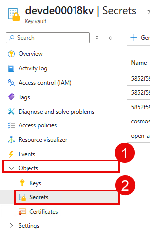

1. Click **+ Generate/Import** **(1)**.

   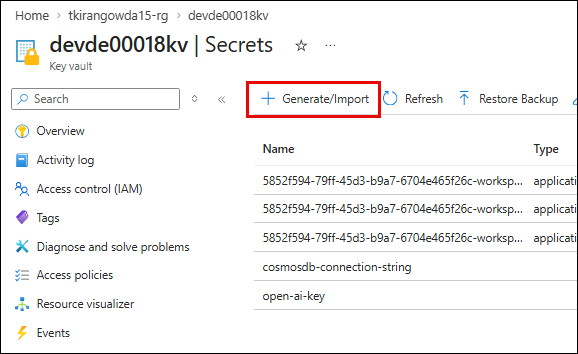

1. On the **Create a secret** page, enter the following details:

   - **Name:** Enter `ai-foundry-key` **(1)**
   - **Secret value:** Paste the **KEY 1** value you copied from the AI Services resource in the previous task **(2)**

   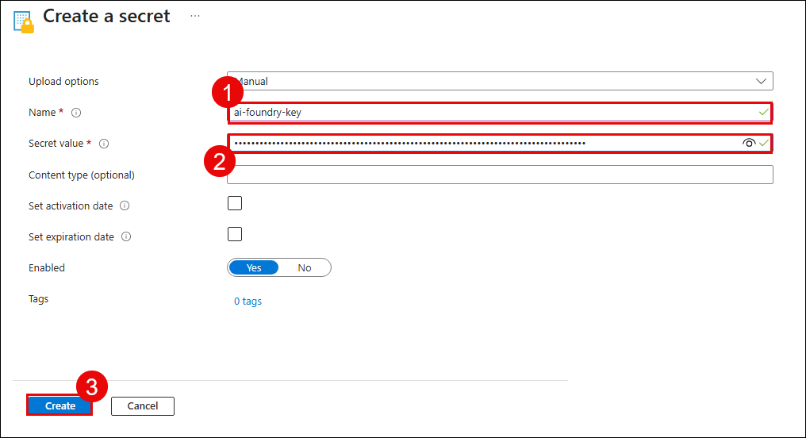

1. Click **Create** **(1)**.

   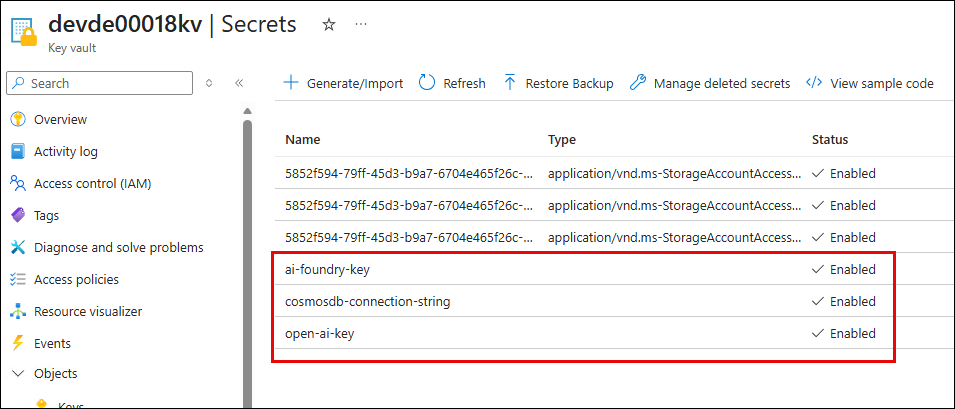

1. Verify that the secret **ai-foundry-key** **(1)** now appears in the list of secrets alongside **cosmosdb-connection-string** and **open-ai-key**.

   

   >**Note:** The application uses three Key Vault secrets: **cosmosdb-connection-string** (Cosmos DB MongoDB connection), **open-ai-key** (Azure OpenAI API key), and **ai-foundry-key** (AI Services key). Values marked with `type: "secret"` in the app configuration are automatically resolved from Key Vault at runtime.

### Task 4: Navigate Azure AI Foundry and explore the Content Understanding project

In this task, you will explore Azure AI Foundry to understand the Content Understanding project that organizes your extraction analyzers.

1. Go back to the resource group. Click on the **AI Services** resource **devde<inject key="DeploymentID" enableCopy="false" />ais** **(1)** that you created in Task 2.

   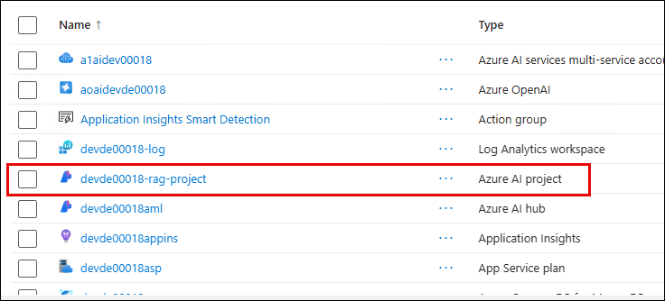

1. On the overview page, click **Go to Azure AI Foundry** **(1)** to open the AI Foundry portal.

   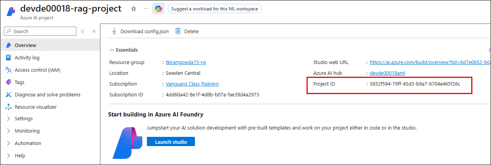

1. In Azure AI Foundry, you should see the project **devde<inject key="DeploymentID" enableCopy="false" />-rag-project** **(1)** in the left navigation. Click on it.

   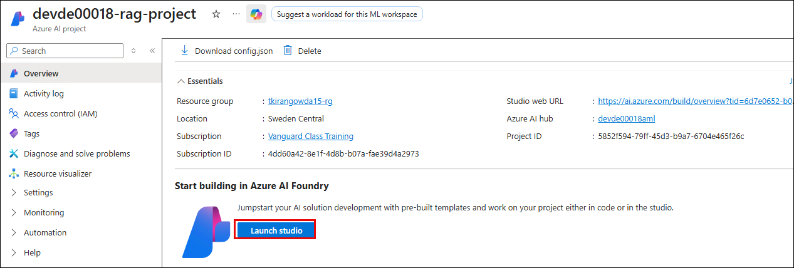

   >**Note:** This project was pre-created as part of the lab setup. A project in AI Foundry provides a workspace where Content Understanding analyzers are organized. When the application creates an analyzer, it tags it with this project ID so it appears under this project.

1. On the project overview page, locate and copy the **Project ID** **(1)** — you will need this value when configuring the application in Lab 02.

   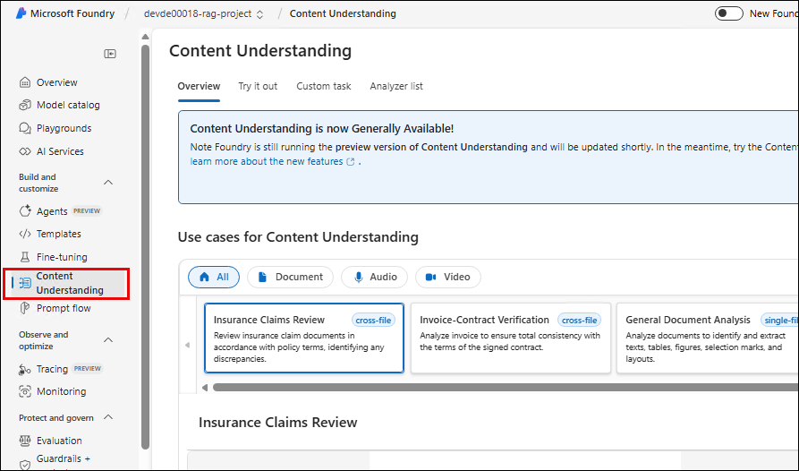

   >**Note:** Save this Project ID to a text file — you will paste it into the application configuration in Lab 02, Task 2.

## Summary

In this lab, you have completed the following:

- Explored the pre-deployed Azure resources including Key Vault, Cosmos DB, Azure OpenAI, and the gpt-4o model deployment.
- Created an **Azure AI Services** resource that hosts the Content Understanding extraction engine.
- Stored the AI Services API key securely in **Azure Key Vault**.
- Navigated **Azure AI Foundry** and identified the Content Understanding project and project ID.

### You have successfully completed the lab. Click **Next >>** to proceed to the next lab.
