# Lab 02: Configure and Extract Documents Using Content Understanding

### Estimated Duration: 60 Minutes

## Overview

In this lab, you will configure the document extraction application with the Azure resource endpoints you explored in Lab 01, start the Function App locally, upload an extraction configuration that creates a Content Understanding analyzer, ingest a sample lease agreement, and examine the extracted results in Azure Cosmos DB.

## Objectives

In this lab, you will complete the following tasks:

- Task 1: Set up the Python environment
- Task 2: Configure the application with Azure endpoints
- Task 3: Start the Function App locally
- Task 4: Upload the extraction configuration
- Task 5: Ingest a document and examine extracted data

### Task 1: Set up the Python environment

In this task, you will set up the Python virtual environment required to run the application locally.

1. On the desktop, double-click the **Visual Studio Code** **(1)** shortcut to open the project.

   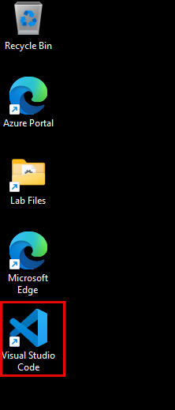

1. In VS Code, click the **menu icon (...)** **(1)** at the top, hover over **Terminal** **(2)**, and select **New Terminal** **(3)**.

   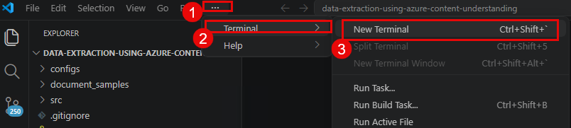

1. Verify you are in the project root directory. Run the following command:

   ```
   cd C:\LabFiles\data-extraction-using-azure-content-understanding
   ```

   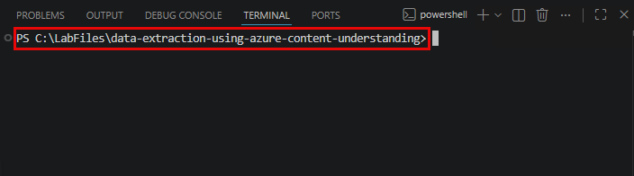

1. Create a Python virtual environment by running the following command:

   ```
   python -m venv .venv
   ```

   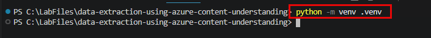

1. Activate the virtual environment by running the following command:

   ```
   .venv\Scripts\activate
   ```

1. You should see `(.venv)` **(1)** appear at the beginning of your terminal prompt, confirming the virtual environment is active.

   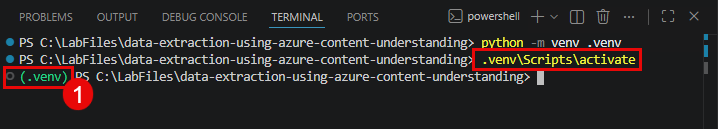

1. Install the project dependencies by running the following command:

   ```
   pip install -r requirements.txt
   ```

   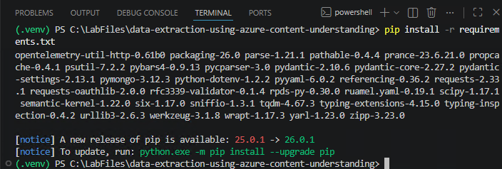

   >**Note:** This installs all required Python packages including `azure-functions`, `azure-identity`, `azure-keyvault-secrets`, `azure-cosmos`, `semantic-kernel`, and other dependencies. This may take 2-3 minutes.

### Task 2: Configure the application with Azure endpoints

In this task, you will configure the application with the correct Azure resource endpoints so it can connect to Content Understanding, Azure OpenAI, Cosmos DB, and Key Vault.

1. First, sign in to Azure CLI so the application can authenticate to Key Vault and other services. In the terminal, run the following command:

   ```
   az login
   ```

   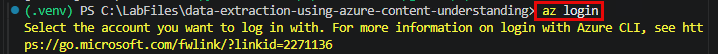

1. A browser window will open. Sign in with the following credentials:

   - **Email:** <inject key="AzureAdUserEmail"></inject>
   - **Password:** <inject key="AzureAdUserPassword"></inject>

   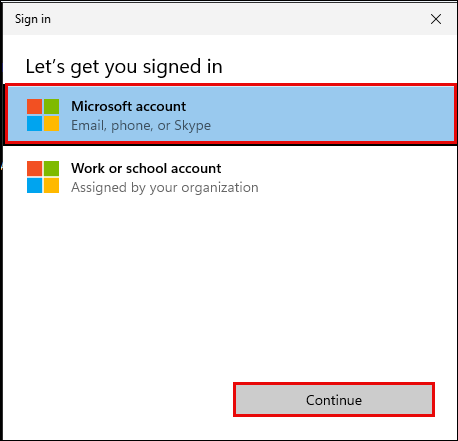

1. After successful login, return to VS Code. Set your active subscription by running the following command:

   ```
   az account set --subscription "<inject key="Subscription ID" enableCopy="true" />"
   ```

   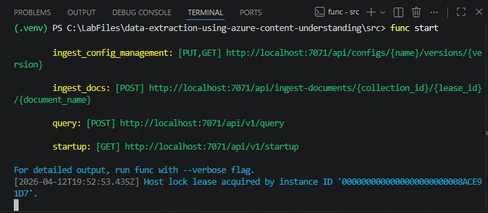

1. In the VS Code Explorer panel, expand **src** **(1)** > **resources** **(2)** and click on **app_config.yaml** **(3)** to open it.

   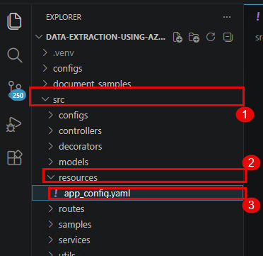

1. Scroll down to the `local:` section **(1)**. This is the configuration used when running the Function App locally. Update the following values using the information from Lab 01:

   | Setting | Value |
   |---------|-------|
   | `key_vault_uri` | `https://devde<inject key="DeploymentID" enableCopy="false" />kv.vault.azure.net/` |
   | `tenant_id` | <inject key="TenantID" enableCopy="true" /> |
   | `user_managed_identity.client_id.value` | The **Client ID** of the managed identity (found on the Function App’s **Identity** page in the portal) |
   | `llm.endpoint.value` | `https://aoaidevde<inject key="DeploymentID" enableCopy="false" />.openai.azure.com/openai/deployments/gpt-4o` |
   | `content_understanding.endpoint.value` | The **Endpoint** URL you copied from the AI Services resource in Lab 01 (e.g., `https://devde<inject key="DeploymentID" enableCopy="false" />ais.cognitiveservices.azure.com/`) |
   | `content_understanding.project_id.value` | The **Project ID** you copied from the Azure AI project in Lab 01 |
   | `chat_history.endpoint.value` | `https://devde<inject key="DeploymentID" enableCopy="false" />cosmoskb.documents.azure.com:443/` |
   | `blob_storage.account_url.value` | Navigate to the Storage Account in the portal and copy the **Blob service endpoint** from the **Endpoints** page |

   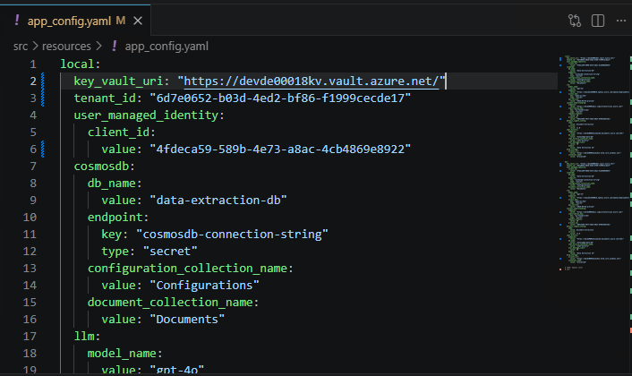

   >**Note:** Values with `type: "secret"` (like **open-ai-key**, **ai-foundry-key**, **cosmosdb-connection-string**) are resolved from Key Vault at runtime - you do NOT paste actual keys here. Only the `value:` fields for endpoints need to be updated.

1. **(Alternative)** If you prefer, you can run the following PowerShell command to quickly retrieve all the configuration values at once and verify your entries:

   ```powershell
   $DID = "<inject key="DeploymentID" enableCopy="true" />"; $RG = "<inject key="Resource Group Name" enableCopy="true" />"; $prefix = "devde$DID"; Write-Output "`n=== App Config Values ==="; Write-Output "key_vault_uri: https://${prefix}kv.vault.azure.net/"; Write-Output "tenant_id: $(az account show --query tenantId -o tsv)"; $mi = az identity list --resource-group $RG --query """[?contains(name,'func')].clientId""" -o tsv; Write-Output "user_managed_identity.client_id: $mi"; Write-Output "llm.endpoint: https://aoai${prefix}.openai.azure.com/openai/deployments/gpt-4o"; Write-Output "content_understanding.endpoint: https://${prefix}ais.cognitiveservices.azure.com/"; $projId = az resource show --name "${prefix}-rag-project" --resource-group $RG --resource-type "Microsoft.MachineLearningServices/workspaces" --query "properties.workspaceId" -o tsv 2>$null; Write-Output "content_understanding.project_id: $projId"; Write-Output "chat_history.endpoint: https://${prefix}cosmoskb.documents.azure.com:443/"; $sa = az storage account list --resource-group $RG --query """[?contains(name,'sa')].primaryEndpoints.blob""" -o tsv; Write-Output "blob_storage.account_url: $sa"
   ```

   >**Note:** This command fetches all values directly from Azure. Use the output to fill in or cross-check the values you entered in `app_config.yaml`.

1. Press **Ctrl+S** to save the file.

### Task 3: Start the Function App locally

In this task, you will start the Azure Functions application locally so you can interact with the extraction API.

1. Before starting the Function App, you need to update `local.settings.json` with the actual Azure Storage connection string. Navigate to the **Azure Portal**, open your **Storage Account** **(1)**, go to **Security + networking** **(2)** > **Access keys** **(3)**, and click **Show** then copy the **Connection string** **(4)**.

   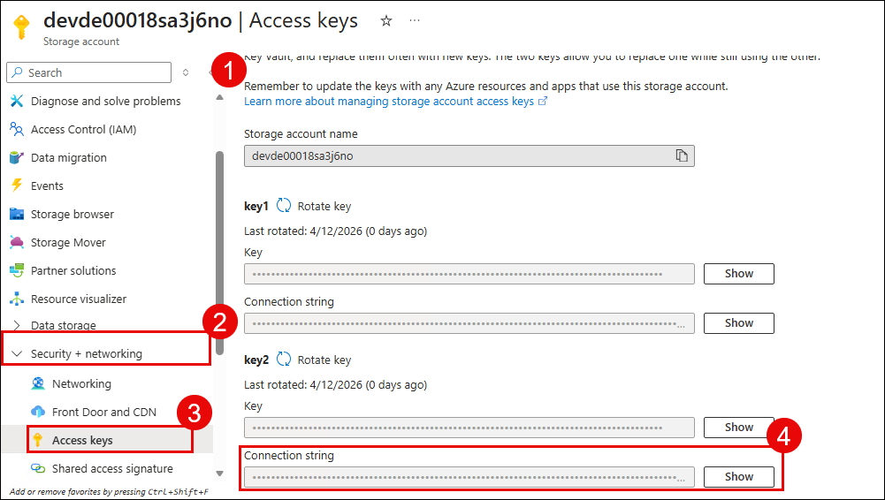

1. In VS Code Explorer, open **src** > **local.settings.json** and replace `UseDevelopmentStorage=true` with the copied connection string:

   ```json
   "AzureWebJobsStorage": "<paste-your-storage-connection-string>"
   ```

   Press **Ctrl+S** to save.

   >**Note:** The `local.settings.json` file is excluded from version control via `.gitignore` as it contains sensitive connection strings. Never commit this file to a repository.

1. In the VS Code terminal, navigate to the `src` folder and start the Function App by running the following commands:

   ```
   cd src
   func start
   ```

1. Wait for the Function App to start. You should see output listing the available HTTP endpoints:

   ```
   Functions:
     configs_upload_ingest_config: [PUT] http://localhost:7071/api/configs/{name}/versions/{version}
     configs_get_ingest_config: [GET] http://localhost:7071/api/configs/{name}/versions/{version}
     configs_get_default_config: [GET] http://localhost:7071/api/configs/default
     ingest_documents: [POST] http://localhost:7071/api/ingest-documents/{collection_id}/{lease_id}/{document_name}
     query: [POST] http://localhost:7071/api/v1/query
     health_check: [GET] http://localhost:7071/api/v1/health
   ```

   

   >**Note:** Keep this terminal running throughout the lab. You will use a separate terminal for the remaining tasks.

1. Open a **second terminal** in VS Code by clicking the **+** icon **(1)** in the terminal panel.

   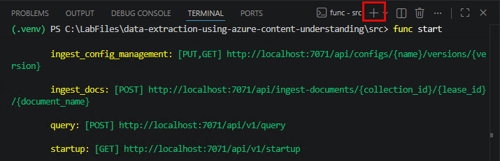

1. In the new terminal, activate the virtual environment and navigate to the project root:

   ```
   cd C:\LabFiles\data-extraction-using-azure-content-understanding
   .venv\Scripts\activate
   ```

1. Test the health check endpoint by running the following command:

   ```
   curl.exe http://localhost:7071/api/v1/health
   ```

1. You should see a JSON response **(1)** showing the status of all connected services (Key Vault, Cosmos DB, OpenAI, Content Understanding, Blob Storage).

   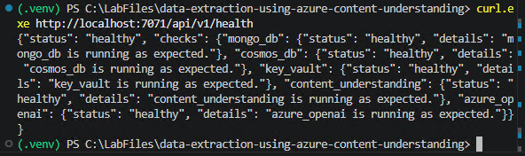

   >**Note:** If any service shows as unhealthy, go back to Task 2 and verify that the corresponding endpoint values are correct in `app_config.yaml`.

### Task 4: Upload the extraction configuration

In this task, you will upload the extraction configuration. This triggers the application to create a **Content Understanding analyzer** with the defined field schema.

1. First, review the extraction configuration file. In VS Code Explorer, click on the **configs** folder and open **document-extraction-v1.0.json**.

   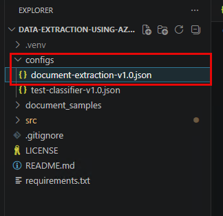

1. Review the configuration structure. Notice the `field_schema` section that defines the 5 fields to extract from documents:

   - **license_grant_scope** - The scope of the license grant
   - **lease_duration** - Duration terms of the lease
   - **termination_conditions** - Conditions under which the lease can be terminated
   - **compliance_audit_terms** - Audit and compliance requirements
   - **prohibited_uses** - Uses that are explicitly prohibited

   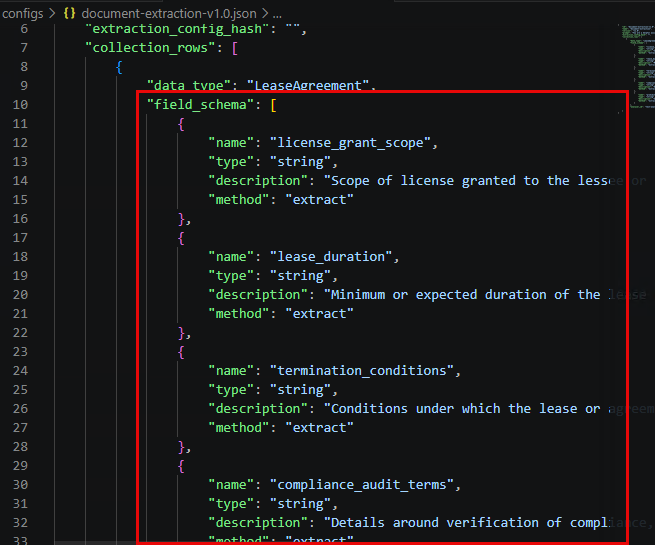

   >**Note:** Each field has a `name`, `type`, `description` (used by Content Understanding as extraction guidance), and `method` set to `"extract"`. The `analyzer_id` is `"test-analyzer"` - this is the ID of the Content Understanding analyzer that will be created when you upload this config.

1. In the second terminal, upload the extraction configuration by running the following command:

   ```
   curl.exe -X PUT "http://localhost:7071/api/configs/document-extraction/versions/v1.0" -H "Content-Type: application/json" -d @configs/document-extraction-v1.0.json
   ```

   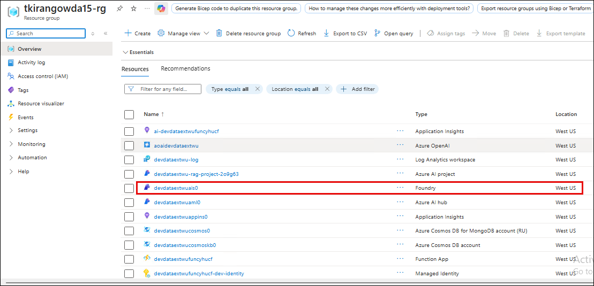

1. Wait for the response. This may take 1-2 minutes as the application is:

   1. Parsing the field schema from the JSON config
   2. Building a Content Understanding analyzer template based on `prebuilt-documentAnalyzer`
   3. Calling the Content Understanding REST API to create the analyzer
   4. Polling until the analyzer creation completes
   5. Storing the configuration in Cosmos DB

   You should see a success response when complete.

   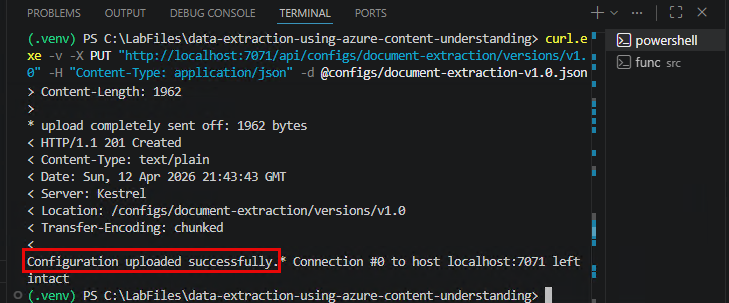

1. Verify the configuration was stored in Cosmos DB. In the Azure Portal, navigate to your **Cosmos DB (MongoDB API)** account **devde<inject key="DeploymentID" enableCopy="false" />cosmos** **(1)**.

   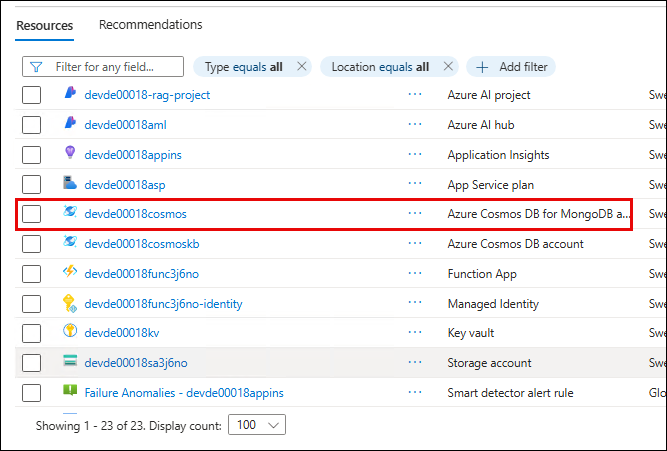

1. In the left menu, click **Data Explorer** **(1)**. Expand **data-extraction-db** **(2)** > **Configurations** **(3)** and click on **a document** **(4)**. You should see the uploaded configuration with the field schema and a computed `extraction_config_hash`.

   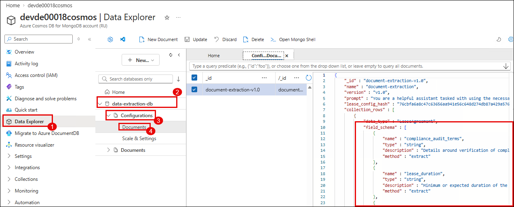

### Task 5: Ingest a document and examine extracted data

In this task, you will send a PDF document through the extraction pipeline. Azure Content Understanding will analyze the document and extract the fields you defined.

1. In the second terminal, ingest the sample lease agreement by running the following command:

   ```
   curl.exe -X POST "http://localhost:7071/api/ingest-documents/Collection1/Lease1/MicrosoftLeaseAgreement" -H "Content-Type: application/octet-stream" --data-binary @document_samples/Agreement_for_leasing_or_renting_certain_Microsoft_Software_Products.pdf
   ```

   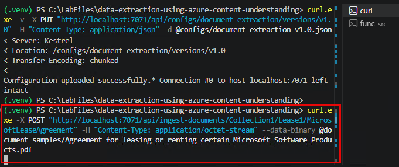

   >**Note:** The URL parameters define: `Collection1` (groups related documents), `Lease1` (identifies a specific lease), and `MicrosoftLeaseAgreement` (the document name).

1. Wait for the response. This may take 2-3 minutes. The extraction pipeline is:

   1. Loading the extraction configuration from Cosmos DB
   2. Sending the PDF to Content Understanding's analyzer endpoint
   3. Polling until the analysis completes
   4. Receiving structured extraction results with field values, confidence scores, and bounding box coordinates
   5. Storing the results in Cosmos DB and the markdown in Blob Storage

   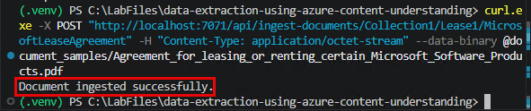

1. Switch to the first terminal (running `func start`) and review the **log messages** **(1)** showing the extraction progress, including the Content Understanding API calls.

   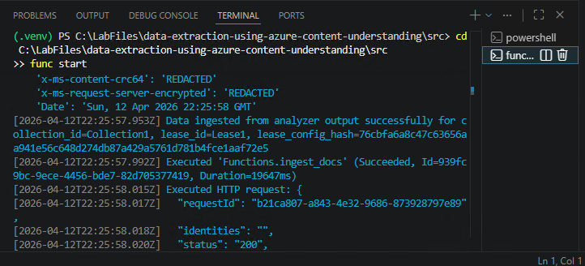

1. In the Azure Portal, navigate to your **Cosmos DB (MongoDB API)** account **devde<inject key="DeploymentID" enableCopy="false" />cosmos** **(1)**.

   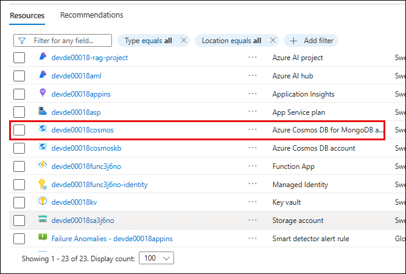

1. Open **Data Explorer** **(1)**. Expand **data-extraction-db** **(2)** > **Documents** **(3)** and click on the document for **Collection1** **(4)**.

   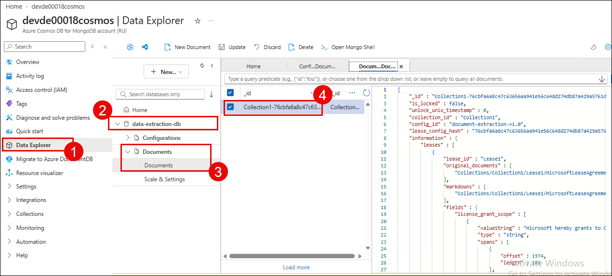

1. Expand the **entities** **(1)** array and then the **fields** **(2)** object. You should see the 5 extracted fields with their values:

   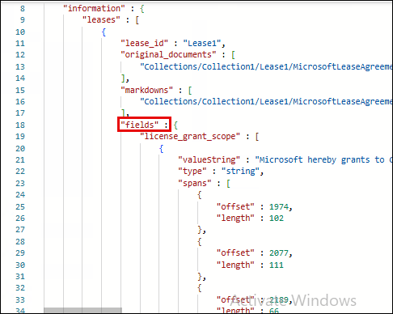

1. For each extracted field, notice the detailed metadata:

   - **valueString** **(1)** - The actual extracted text
   - **confidence** **(2)** - A score between 0 and 1 indicating extraction confidence
   - **spans** **(3)** - Character offset and length in the original document
   - **source** **(4)** - Bounding box coordinates for traceability

   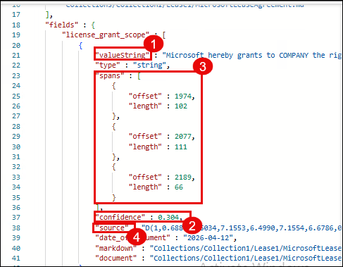

   >**Note:** Confidence scores help assess extraction reliability - low-confidence extractions may need human review. Bounding boxes enable you to trace back to the exact location in the source document.

1. Go back to your resource group and click on the **Storage Account** **(1)** (name starts with **devde<inject key="DeploymentID" enableCopy="false" />sa**).

   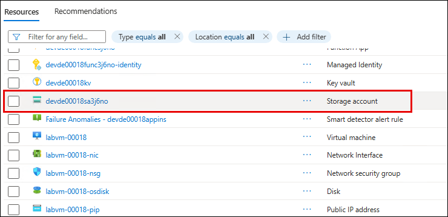

1. In the left menu, click **Data storage** **(1)** > **Containers** **(2)**. Click on the **processed** **(3)** container. 

   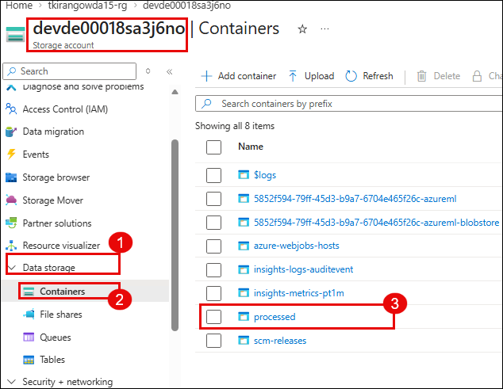

1. You should see the markdown file **(1)** generated by Content Understanding.

   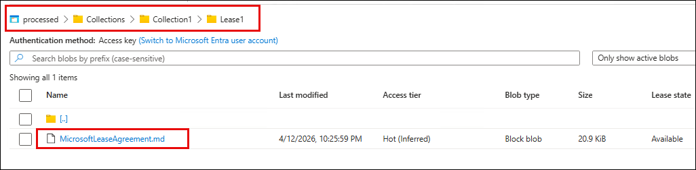

## Summary

In this lab, you have completed the following:

- Set up the Python virtual environment and installed project dependencies.
- Configured the application with Azure resource endpoints and signed in to Azure CLI.
- Started the Function App locally and verified the health check.
- Uploaded the extraction configuration, which automatically created a Content Understanding analyzer.
- Ingested a lease agreement PDF and extracted 5 structured fields with confidence scores.
- Examined the extraction results in Cosmos DB and the processed markdown in Blob Storage.

### You have successfully completed the lab. Click **Next >>** to proceed to the next lab.
