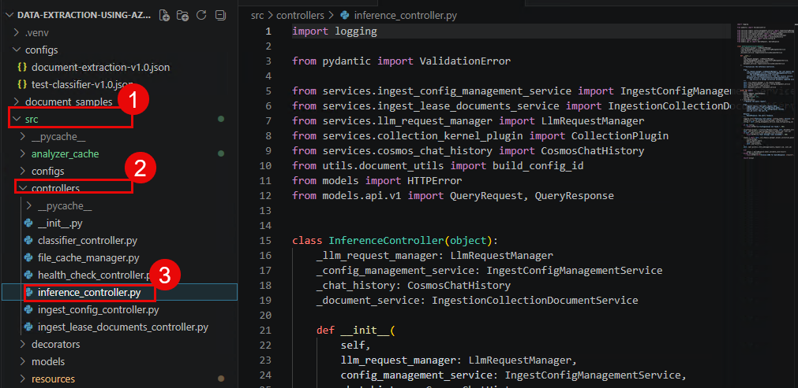
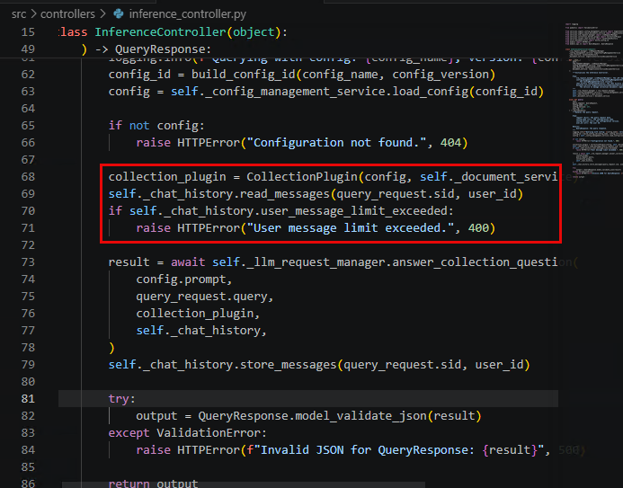
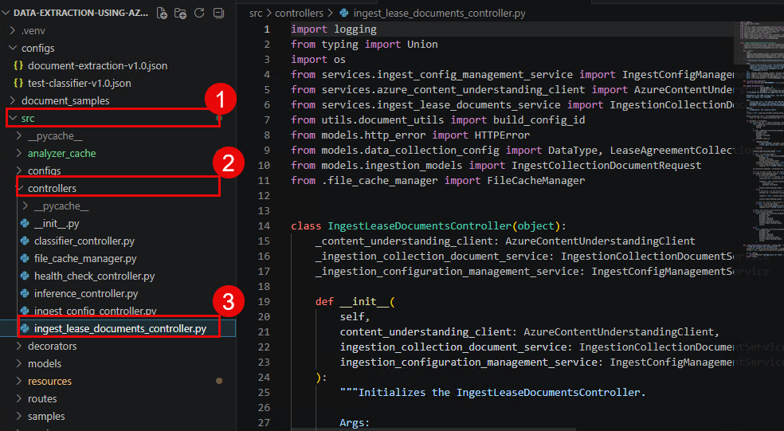
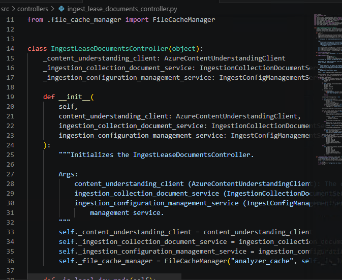
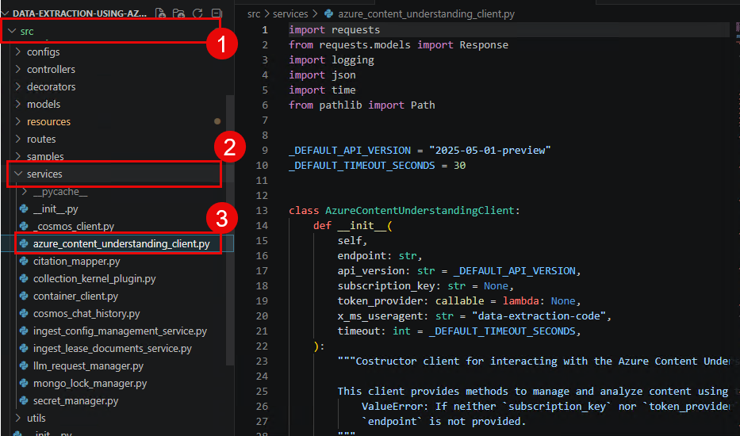

# Lab 03: Query Extracted Data with Azure OpenAI

### Estimated Duration: 45 Minutes

## Overview

In this lab, you will query the extracted document data using natural language. The application uses **Azure OpenAI (gpt-4o)** with **Semantic Kernel** to understand your questions, retrieve the relevant extracted fields from Cosmos DB, and generate intelligent responses with citations. You will also explore multi-turn conversations and examine the chat history stored in Cosmos DB.

## Objectives

In this lab, you will complete the following tasks:

- Task 1: Query extraction results using natural language
- Task 2: Explore multi-turn conversations
- Task 3: Examine chat history in Cosmos DB
- Task 4: Review the Semantic Kernel orchestration code

### Task 1: Query extraction results using natural language

In this task, you will use the query endpoint to ask questions about the data extracted from the lease agreement in Lab 02.

1. Ensure the Function App is still running in your first terminal. If not, start it again:

   ```
   cd C:\LabFiles\data-extraction-using-azure-content-understanding
   .venv\Scripts\activate
   func start
   ```

1. In your second terminal, send a query about the extracted lease data by running the following command:

   ```
   curl.exe -X POST "http://localhost:7071/api/v1/query" -H "Content-Type: application/json" -H "x-user: labuser@contoso.com" -d '{\"cid\": \"Collection1\", \"sid\": \"session1\", \"query\": \"What is the scope of the license grant in Collection1?\"}'
   ```

   

   >**Note:** The request parameters are: `cid` (Collection ID - must match the collection from Lab 02), `sid` (Session ID - groups messages into a conversation), `query` (your natural language question), and `x-user` header (identifies the user for chat history).

1. Review the response. It should contain a **response** field with the LLM-generated answer about the license grant scope, and **citations** referencing the specific extracted fields used.

   

   >**Note:** The application uses Semantic Kernel with `FunctionChoiceBehavior.Required()`, which forces the LLM to call the `get_collection_data()` plugin. This ensures every response is grounded in actual extracted data from Content Understanding - the LLM never makes up information.

1. Try another query about a different extracted field by running the following command:

   ```
   curl.exe -X POST "http://localhost:7071/api/v1/query" -H "Content-Type: application/json" -H "x-user: labuser@contoso.com" -d '{\"cid\": \"Collection1\", \"sid\": \"session1\", \"query\": \"What are the termination conditions?\"}'
   ```

1. Review the response. The LLM provides specific termination conditions extracted from the document, with references back to the source.

   

### Task 2: Explore multi-turn conversations

In this task, you will explore how the system maintains conversation context across multiple queries using chat history.

1. Send a follow-up query using the **same session ID** (`session1`) by running the following command:

   ```
   curl.exe -X POST "http://localhost:7071/api/v1/query" -H "Content-Type: application/json" -H "x-user: labuser@contoso.com" -d '{\"cid\": \"Collection1\", \"sid\": \"session1\", \"query\": \"What about compliance audit terms?\"}'
   ```

1. Notice that the response builds on the context from previous questions. Because the session ID is the same, the LLM has access to the full conversation history.

   

1. Now start a **new session** with a different session ID by running the following command:

   ```
   curl.exe -X POST "http://localhost:7071/api/v1/query" -H "Content-Type: application/json" -H "x-user: labuser@contoso.com" -d '{\"cid\": \"Collection1\", \"sid\": \"session2\", \"query\": \"Summarize all key terms in Collection1.\"}'
   ```

1. This response is independent of the previous conversation since it uses a different session ID. The LLM retrieves all extracted fields and provides a comprehensive summary.

   

### Task 3: Examine chat history in Cosmos DB

In this task, you will examine the conversation history stored in Cosmos DB SQL API.

1. In the Azure Portal, navigate to your **Cosmos DB SQL API account** **devde<inject key="DeploymentID" enableCopy="false" />cosmoskb**.

   

1. In the left menu, click **Data Explorer** **(1)**. Expand **knowledge-base-db** **(2)** > **chat-history** **(3)** and click on **Items** **(4)**.

   

1. Click on a document **(1)** to view its contents. Each document contains:

   | Field | Description |
   |-------|-------------|
   | `id` | Unique message identifier |
   | `session_id` | Groups messages into a conversation (`session1`, `session2`) |
   | `user_id` | The user identifier from the `x-user` header |
   | `role` | Either `user` (your query) or `assistant` (LLM response) |
   | `content` | The actual message text |

   

1. Compare documents from `session1` (which has multiple messages showing conversation context) versus `session2` (which has a single exchange). This demonstrates how session-based chat history enables multi-turn conversations.

   

### Task 4: Review the Semantic Kernel orchestration code

In this task, you will examine the code to understand how Semantic Kernel orchestrates the query pipeline.

1. In VS Code, expand **src** **(1)** > **controllers** **(2)** in the Explorer panel and click on **inference_controller.py** **(3)**.

   

1. Locate the section where Semantic Kernel is configured. Notice the key elements:

   - A `CollectionPlugin` is created that exposes a `get_collection_data()` function
   - The plugin is added to the Semantic Kernel instance
   - `FunctionChoiceBehavior.Required()` is set, forcing the LLM to call the plugin on every request

   

   >**Note:** Without `Required()`, the LLM might try to answer from its training data instead of the extracted documents. By forcing tool usage, every response is grounded in actual extracted data from Content Understanding.

1. Open **src** **(1)** > **controllers** **(2)** > **ingest_lease_documents_controller.py** **(3)** to review the ingestion pipeline:

   

1. Notice how the controller loads the extraction config from Cosmos DB, calls Content Understanding via `begin_analyze_data()` , polls for the result, and stores the output in Cosmos DB .

   

1. Open **src** **(1)** > **services** **(2)** > **azure_content_understanding_client.py** **(3)** to review the REST API integration:

   

1. Review the key API operations:

   - **Analyzer creation**: `PUT /contentunderstanding/analyzers/{id}` - creates a custom analyzer
   - **Document analysis**: `POST /contentunderstanding/analyzers/{id}:analyze` - sends document for extraction
   - **Polling**: `GET {operation-location}` - polls until the async operation completes

   
   >**Note:** All Content Understanding operations are **asynchronous long-running operations (LROs)**. You submit a request, receive an `operation-location` URL, and poll until completion. This pattern handles large documents that may take several minutes to process.

## Summary

In this lab, you have completed the following:

- Queried extracted document data using natural language and received LLM-generated responses with citations.
- Explored multi-turn conversations using session-based chat history.
- Examined the chat history stored in Cosmos DB SQL API.
- Reviewed the Semantic Kernel orchestration code that forces the LLM to retrieve data from Cosmos DB before responding.

### You have successfully completed the lab. Click **Next >>** to proceed to the next lab.
