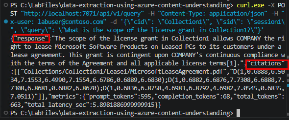
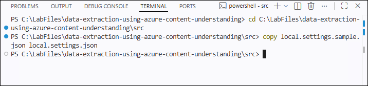
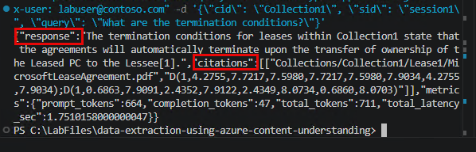
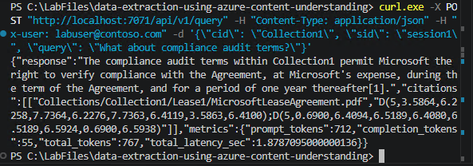
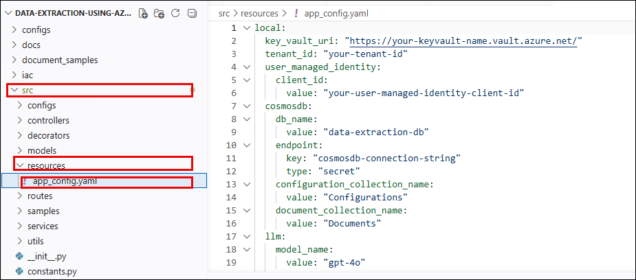
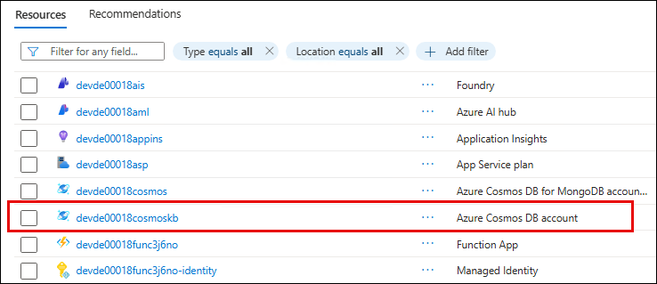
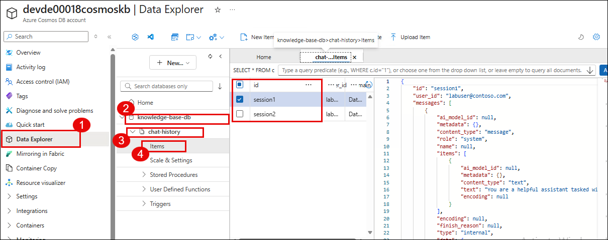
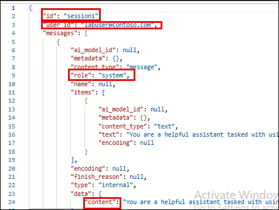
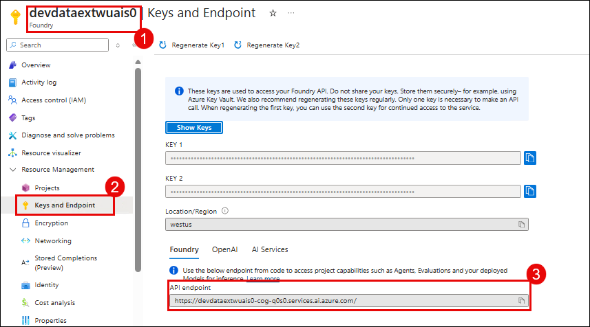

# Lab 03: Query Extracted Data with Azure OpenAI

### Estimated Duration: 45 Minutes

## Overview

In this lab, you will query the extracted document data using natural language. The application uses **Azure OpenAI (gpt-4o)** with **Semantic Kernel** to understand your questions, retrieve the relevant extracted fields from Cosmos DB, and generate intelligent responses with citations. You will also explore multi-turn conversations and examine the chat history stored in Cosmos DB.

## Objectives

After completing this lab, you will have:

- Queried extracted document data using natural language
- Explored multi-turn conversations with contextual follow-ups
- Examined chat history stored in Cosmos DB (SQL API)
- Understood how Semantic Kernel orchestrates the query pipeline

### Task 1: Query extraction results using natural language

In this task, you will use the query endpoint to ask questions about the data extracted from the lease agreement in Lab 02.

1. Ensure the Function App is still running in your first terminal. If not, start it again:

   ```
   cd C:\LabFiles\data-extraction-using-azure-content-understanding
   .venv\Scripts\activate
   func start
   ```

1. In your second terminal, send a query about the extracted lease data:

   ```
   curl.exe -X POST "http://localhost:7071/api/v1/query" `
     -H "Content-Type: application/json" `
     -H "x-user: labuser@contoso.com" `
     -d "{\"cid\": \"Collection1\", \"sid\": \"session1\", \"query\": \"What is the scope of the license grant in Collection1?\"}"
   ```

   >**Understanding the request parameters:**
   > - `cid` (Collection ID) — Identifies which collection to query. Must match the collection you ingested in Lab 02 (`Collection1`).
   > - `sid` (Session ID) — Groups messages into a conversation thread for multi-turn chat.
   > - `query` — Your natural language question.
   > - `x-user` header — Identifies the user for chat history tracking.

1. Review the response. It should contain:

   - **`response`** — The LLM-generated answer about the license grant scope, based on the extracted data
   - **`citations`** — References to the specific extracted fields that were used, including document names and field locations

   >**How does this work?** The application uses Semantic Kernel with `FunctionChoiceBehavior.Required()`, which forces the LLM to call the `get_collection_data()` plugin function. This function retrieves all extracted fields for the specified collection from Cosmos DB. The LLM then uses this structured data as context to formulate its response — it never makes up information; it only references what was actually extracted.

   

1. Try another query about a different extracted field:

   ```
   curl.exe -X POST "http://localhost:7071/api/v1/query" `
     -H "Content-Type: application/json" `
     -H "x-user: labuser@contoso.com" `
     -d "{\"cid\": \"Collection1\", \"sid\": \"session1\", \"query\": \"What are the termination conditions?\"}"
   ```

1. Review the response. Notice that the LLM provides specific termination conditions extracted from the document, with references back to the source.

   

### Task 2: Explore multi-turn conversations

In this task, you will explore how the system maintains conversation context across multiple queries using chat history.

1. Send a follow-up query using the **same session ID** (`session1`):

   ```
   curl.exe -X POST "http://localhost:7071/api/v1/query" `
     -H "Content-Type: application/json" `
     -H "x-user: labuser@contoso.com" `
     -d "{\"cid\": \"Collection1\", \"sid\": \"session1\", \"query\": \"What about compliance audit terms?\"}"
   ```

1. Notice that the response builds on the context from previous questions. Because the session ID is the same, the LLM has access to the conversation history and can provide more contextual answers.

   

1. Now start a **new session** with a different session ID to see a fresh conversation:

   ```
   curl.exe -X POST "http://localhost:7071/api/v1/query" `
     -H "Content-Type: application/json" `
     -H "x-user: labuser@contoso.com" `
     -d "{\"cid\": \"Collection1\", \"sid\": \"session2\", \"query\": \"Summarize all key terms in Collection1.\"}"
   ```

1. This response should be independent of the previous conversation since it uses a different session ID. The LLM retrieves all extracted fields and provides a comprehensive summary.

   >**Multi-turn architecture:** Chat history is stored in the **Cosmos DB SQL API** (separate from the MongoDB API used for documents). Each message includes the user query, assistant response, session ID, and user identifier. The system limits chat history to the 20 most recent messages per session to keep the LLM context manageable.

   

### Task 3: Examine chat history in Cosmos DB

In this task, you will examine the conversation history stored in Cosmos DB SQL API.

1. In the Azure Portal, navigate to your **Cosmos DB SQL API account** (**devde<inject key="DeploymentID" enableCopy="false" />cosmoskb**).

1. Open **Data Explorer**. Expand **knowledge-base-db** > **chat-history** and browse the stored documents.

   

1. You should see conversation entries for your sessions. Each document contains:

   | Field | Description |
   |-------|-------------|
   | `id` | Unique message identifier |
   | `session_id` | Groups messages into a conversation (`session1`, `session2`) |
   | `user_id` | The user identifier from the `x-user` header |
   | `role` | Either `user` (your query) or `assistant` (LLM response) |
   | `content` | The actual message text |
   | `timestamp` | When the message was created |

1. Compare `session1` (which has multiple messages showing conversation context) with `session2` (which has a single exchange). This demonstrates how session-based chat history enables multi-turn conversations.

   >**Why separate Cosmos DB accounts?** The MongoDB API account stores extraction configurations and extracted document data — its flexible schema handles nested field arrays, bounding boxes, and confidence scores. The SQL API account stores chat history — simple key-value lookups by session ID with a partition key of `/id` for efficient retrieval.

   

### Task 4: Understand the Semantic Kernel orchestration

In this task, you will examine the code to understand how Semantic Kernel orchestrates the query pipeline.

1. In VS Code, open **src/controllers/inference_controller.py**.

1. Notice the key section where Semantic Kernel is configured:

   - A `CollectionPlugin` is created that exposes a `get_collection_data()` function. This function queries Cosmos DB for all extracted fields in the specified collection.
   - The plugin is added to the Semantic Kernel instance.
   - `FunctionChoiceBehavior.Required()` is set, which **forces** the LLM to call the plugin function on every request — the LLM cannot respond without first retrieving data from Cosmos DB.

   >**Why forced tool calling?** Without `Required()`, the LLM might try to answer from its training data instead of the extracted documents. By forcing tool usage, every response is grounded in actual extracted data from Content Understanding.

   

1. Open **src/controllers/ingest_lease_documents_controller.py** and review how the ingestion pipeline:

   - Loads the extraction config from Cosmos DB
   - Calls Content Understanding's analyzer via `begin_analyze_data()` with the raw PDF bytes
   - Polls for the result using `poll_result()` (Content Understanding is a long-running async operation)
   - Stores the extracted output in Cosmos DB

   

1. Open **src/services/azure_content_understanding_client.py** and review the REST API integration:

   - **Analyzer creation:** `PUT /contentunderstanding/analyzers/{id}` — creates a custom analyzer based on `prebuilt-documentAnalyzer`
   - **Document analysis:** `POST /contentunderstanding/analyzers/{id}:analyze` — sends document bytes for extraction
   - **Polling:** `GET {operation-location}` — polls the async operation until `succeeded` or `failed`
   - **Authentication:** Uses `Ocp-Apim-Subscription-Key` header with the AI Services key

   >**Content Understanding API pattern:** All Content Understanding operations are **asynchronous long-running operations (LROs)**. You submit a request, receive an `operation-location` URL in the response headers, and poll that URL until the operation completes. This pattern handles large documents that may take several minutes to process.

   

## Summary

In this lab, you:

1. Queried extracted document data using natural language and received LLM-generated responses with citations.
2. Explored multi-turn conversations using session-based chat history.
3. Examined the chat history stored in Cosmos DB SQL API.
4. Understood how Semantic Kernel forces the LLM to retrieve data from Cosmos DB before responding, ensuring all answers are grounded in extracted data.

In the next lab, you will deploy the Function App to Azure and monitor it with Application Insights.
