# Lab 04: Deploy to Azure and Monitor

### Estimated Duration: 45 Minutes

## Overview

In this lab, you will deploy the document extraction Function App to Azure and test the deployed endpoints. You will configure the deployment settings, publish the Function App, run end-to-end tests against the cloud-hosted API, and monitor application performance using Application Insights.

## Objectives

In this lab, you will complete the following tasks:

- Task 1: Configure deployment settings
- Task 2: Deploy the Function App to Azure
- Task 3: Test deployed endpoints
- Task 4: Monitor with Application Insights

### Task 1: Configure deployment settings

In this task, you will update the application configuration for the deployed environment and prepare the Function App for deployment.

1. In VS Code, stop the locally running Function App by pressing **Ctrl+C** in the terminal where `func start` is running.

   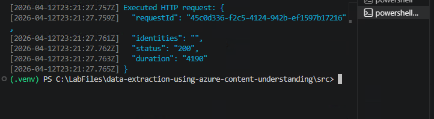

1. Open **src** **(1)** > **resources** **(2)** > **app_config.yaml** **(3)** in the VS Code Explorer panel.

   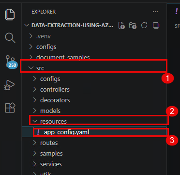

1. Scroll down to the `dev:` section **(1)** (below the `local:` section). The deployed Function App reads this section because the `ENVIRONMENT` app setting is set to `"dev"`.

   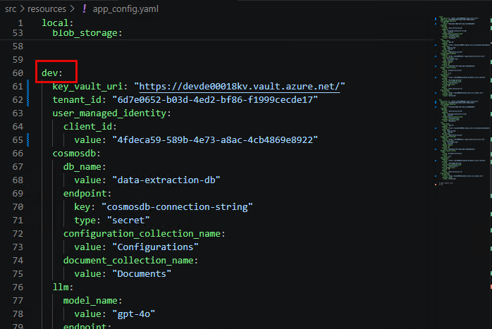

1. Update the `dev:` section with the same Azure resource endpoints you configured for the `local:` section in Lab 02. Additionally, locate the `user_managed_identity.client_id` field.


1. To find the managed identity client ID, go to the Azure Portal. Navigate to your resource group and click on the **Managed Identity** resource (named **devde<inject key="DeploymentID" enableCopy="false" />func**-identity or similar).
On the Managed Identity overview page, copy the **Client ID** value.

   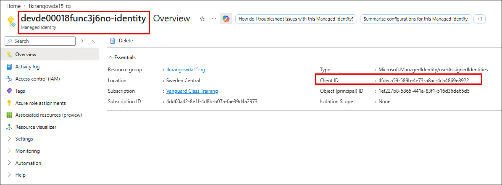

1. Go back to VS Code. Paste the Client ID into the `user_managed_identity.client_id` field **(1)** in the `dev:` section of `app_config.yaml`.

   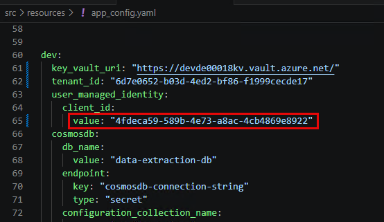

   >**Note:** The deployed Function App uses its **managed identity** to authenticate to Azure services (Key Vault, Cosmos DB, Storage, OpenAI) instead of user credentials. The client ID tells the application which managed identity to use.

1. Press **Ctrl+S** to save the file.

### Task 2: Deploy the Function App to Azure

In this task, you will deploy the Function App to Azure using Azure Functions Core Tools.

1. In the VS Code terminal, retrieve your Function App name by running the following command:

   ```
   $funcApp = (az functionapp list --resource-group <inject key="Resource Group Name" enableCopy="false" /> --query "[0].name" -o tsv)
   echo "Your Function App name is: $funcApp"
   ```

   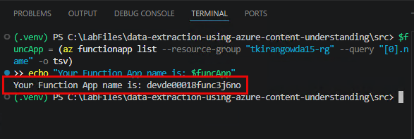

   >**Note:** The output should show a name like **devde<inject key="DeploymentID" enableCopy="false" />func** followed by a random suffix. You will use `$funcApp` in the remaining commands.

1. Copy the `requirements.txt` file into the `src/` directory so the Azure Functions deployment can find it:

   ```
   Copy-Item requirements.txt src\
   ```

1. Deploy the Function App to Azure by running the following command:

   ```
   func azure functionapp publish $funcApp --python --script-root ./src/
   ```

   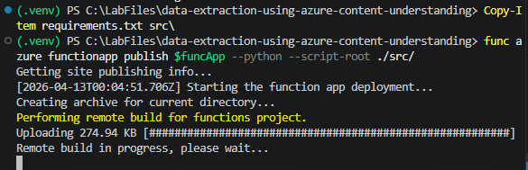

1. Wait for the deployment to complete. This may take 3-5 minutes. You should see output ending with:

   ```
   Remote build succeeded!
   ```

   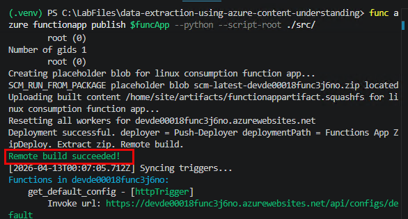

### Task 3: Test deployed endpoints

In this task, you will test all the deployed API endpoints to verify the full extraction pipeline works in Azure.

1. Test the health check on the deployed endpoint by running the following command:

   ```
   curl.exe https://$funcApp.azurewebsites.net/api/v1/health
   ```

1. Verify all services show as **healthy**.

   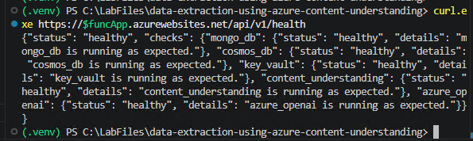

1. Upload the extraction configuration to the deployed endpoint by running the following command:

   ```
   curl.exe -X PUT "https://$funcApp.azurewebsites.net/api/configs/document-extraction/versions/v1.0" -H "Content-Type: application/json" -d @configs/document-extraction-v1.0.json
   ```

   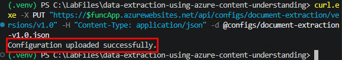

1. Ingest the document to the deployed endpoint by running the following command:

   ```
   curl.exe -X POST "https://$funcApp.azurewebsites.net/api/ingest-documents/Collection1/Lease1/MicrosoftLeaseAgreement" -H "Content-Type: application/octet-stream" --data-binary @document_samples/Agreement_for_leasing_or_renting_certain_Microsoft_Software_Products.pdf
   ```

   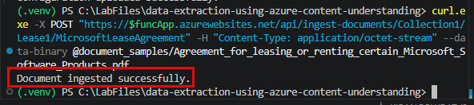

   >**Note:** This step may take 2-3 minutes as Content Understanding processes the document on the Azure-hosted Function App.

1. Query the deployed endpoint by running the following command:

   ```
   curl.exe -X POST "https://$funcApp.azurewebsites.net/api/v1/query" -H "Content-Type: application/json" -H "x-user: labuser@contoso.com" -d '{\"cid\": \"Collection1\", \"sid\": \"azure-session1\", \"query\": \"Summarize all key terms in Collection1.\"}'
   ```

1. Verify that the response includes the answer with citations, confirming the full pipeline works end-to-end in Azure.

   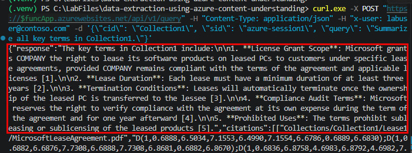

### Task 4: Monitor with Application Insights

In this task, you will use Application Insights to monitor the deployed Function App.

1. In the Azure Portal, navigate to your **Function App** (the name you captured in the `$funcApp` variable).

   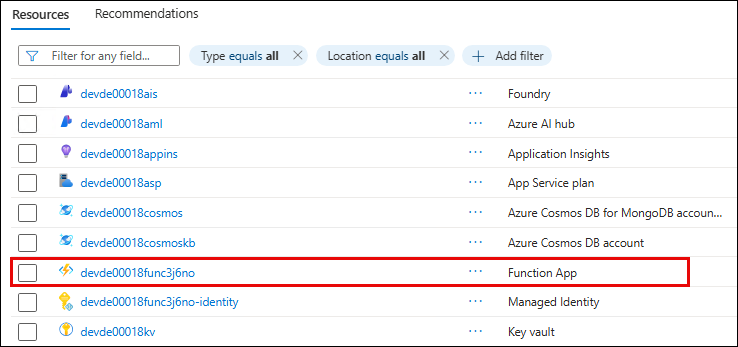

1. In the left menu, click **Monitoring** **(1)** > **Application Insights** **(2)**, then click the Application Insights resource name link **(3)** to open the connected App Insights instance.

   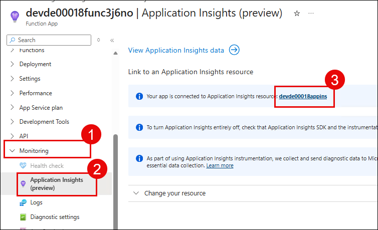

1. In the Application Insights resource, click on **Investigate** **(1)** > **Live Metrics** **(2)** in the left menu.

   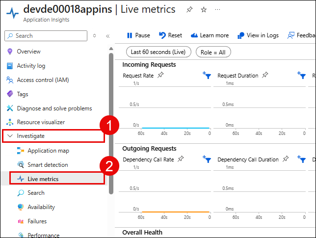

1. While Live Metrics is open, go back to the VS Code terminal and send another query to generate traffic:

   ```
   curl.exe -X POST "https://$funcApp.azurewebsites.net/api/v1/query" -H "Content-Type: application/json" -H "x-user: labuser@contoso.com" -d '{\"cid\": \"Collection1\", \"sid\": \"azure-session1\", \"query\": \"What are the prohibited uses?\"}'
   ```

1. Go back to the Azure Portal. Observe the Live Metrics dashboard updating in real-time - you should see the incoming request, response time, and dependency calls to Cosmos DB and Azure OpenAI.

   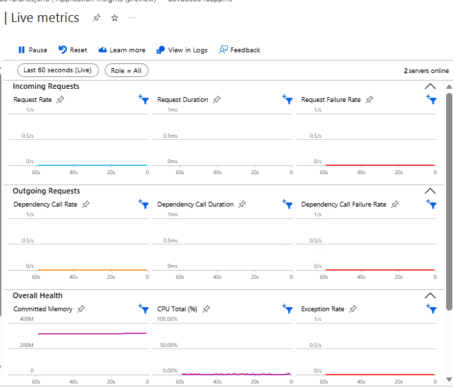

1. In the left menu, click **Investigate** **(1)** > **Search** **(2)**. Click **See all data in the last 24 hours** **(3)**.

   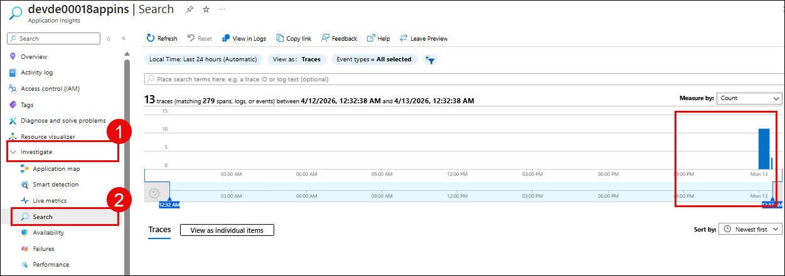

1. Click on one of the query requests **(1)** to open the **end-to-end transaction details**. This view shows the complete request lifecycle:

   - The initial HTTP request to the Function App
   - Dependency calls to Cosmos DB (retrieve config, get extracted data, store chat history)
   - Dependency calls to Azure OpenAI (LLM inference)
   - Response time breakdown for each component

   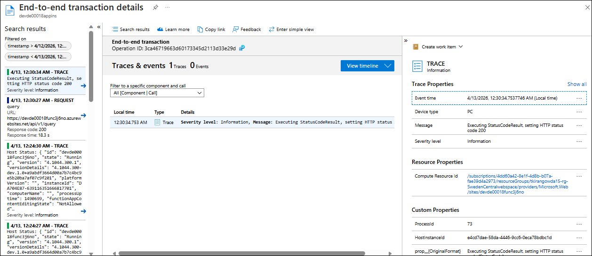

   >**Note:** Application Insights lets you identify bottlenecks in the extraction pipeline. If Content Understanding extraction is slow, you can see it in the dependency timing. If the LLM response takes too long, you can pinpoint that separately.

## Summary

In this lab, you have completed the following:

- Configured the deployed Function App with Azure resource endpoints and managed identity client ID.
- Deployed the Function App to Azure using Azure Functions Core Tools.
- Tested all deployed endpoints - health check, config upload, document ingestion, and natural language query.
- Monitored the application with Application Insights live metrics and transaction search.

## Congratulations!

You have completed all labs in the **Data Extraction Using Azure Content Understanding** workshop. You have successfully:

- Created an **Azure AI Services** resource and connected it to Azure AI Foundry.
- Configured a document extraction pipeline with custom field schemas.
- Extracted structured data from a lease agreement using **Content Understanding** analyzers.
- Queried the extracted data using natural language powered by **Azure OpenAI** and **Semantic Kernel**.
- Deployed the solution to Azure and monitored it with **Application Insights**.

These skills enable you to build intelligent document processing solutions that automatically extract, store, and query structured information from unstructured documents at scale.
