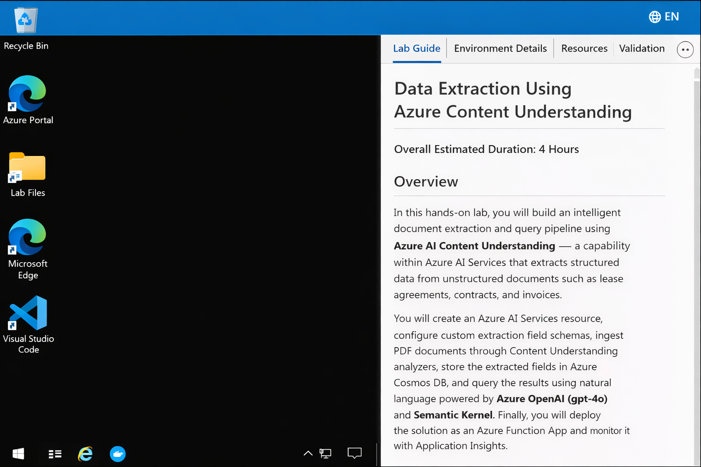
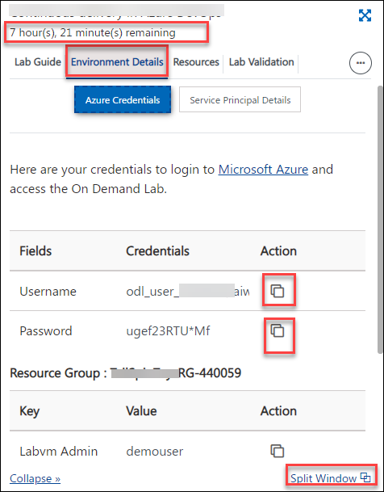
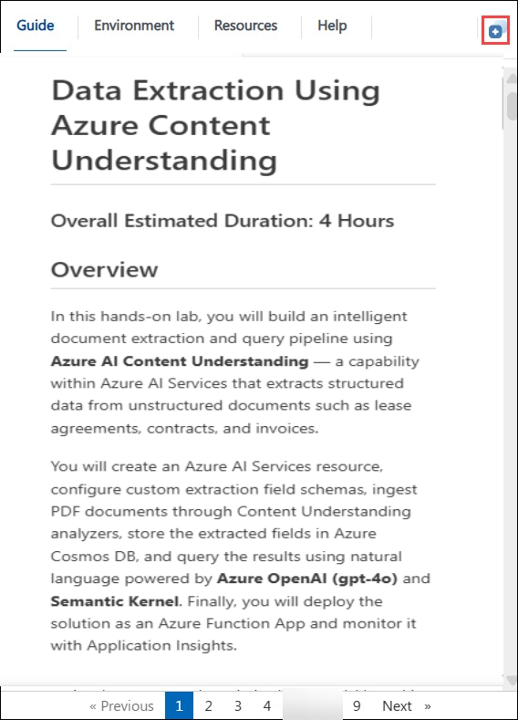
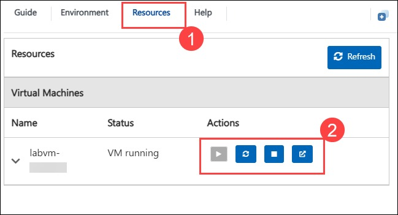
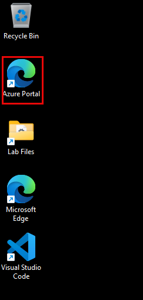
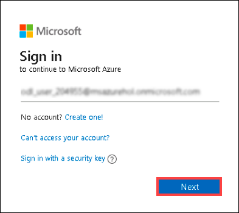
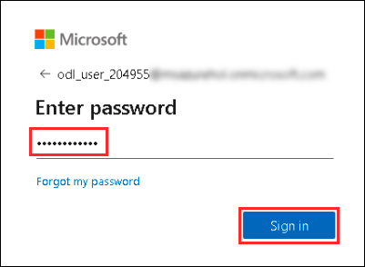
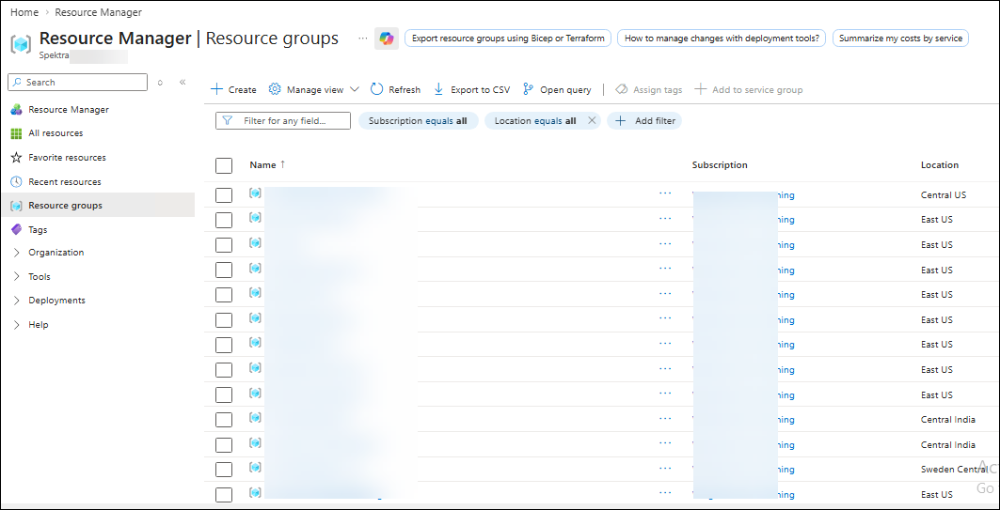
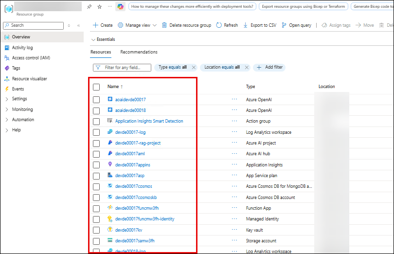

# Data Extraction Using Azure Content Understanding

### Overall Estimated Duration: 4 Hours

## Overview

In this hands-on lab, you will build an intelligent document extraction and query pipeline using **Azure AI Content Understanding** - a capability within Azure AI Services that extracts structured data from unstructured documents such as lease agreements, contracts, and invoices.

You will create an Azure AI Services resource, configure custom extraction field schemas, ingest PDF documents through Content Understanding analyzers, store the extracted fields in Azure Cosmos DB, and query the results using natural language powered by **Azure OpenAI (gpt-4o)** and **Semantic Kernel**. Finally, you will deploy the solution as an Azure Function App and monitor it with Application Insights.

## Objectives

In this lab, you will complete the following:

- **Create and configure Azure AI Services** - Deploy the core Content Understanding resource and connect it to Azure AI Foundry.
- **Configure a Document Extraction Pipeline** - Set up a Python-based Azure Functions application that connects to Content Understanding, Azure OpenAI, Cosmos DB, Key Vault, and Blob Storage.
- **Extract Structured Data from Documents** - Define extraction field schemas, create Content Understanding analyzers, ingest PDF documents, and examine extracted results with confidence scores.
- **Query Extracted Data Using Natural Language** - Use Azure OpenAI's gpt-4o model with Semantic Kernel to ask questions about extracted document data and explore multi-turn conversations.
- **Deploy and Monitor on Azure** - Deploy the extraction pipeline as an Azure Function App and monitor performance using Application Insights.

## Pre-requisites

The following tools and services are **pre-installed** on your lab VM - no manual setup is needed:

| Tool | Version | Purpose |
|------|---------|---------|
| Python | 3.12 | Application runtime |
| Azure CLI | Latest | Azure resource management |
| Azure Functions Core Tools | v4 | Local function app development |
| Git | Latest | Source control |
| Node.js | 18 LTS | Azure Functions dependency |
| Visual Studio Code | Latest | Code editor with extensions |
| .NET 8.0 SDK | Latest | Azure Functions host |

## Architecture

The solution implements two main workflows - **Document Ingestion** (extraction) and **Document Enquiry** (querying) - running as HTTP-triggered Azure Functions.

**Document Ingestion Flow:**
1. The Function App retrieves the extraction configuration from Cosmos DB, which defines what fields to extract.
2. The document is sent to **Azure AI Content Understanding**, which extracts structured fields with confidence scores and bounding box coordinates.
3. The extracted markdown is stored in **Azure Blob Storage**.
4. The structured extraction results are stored in **Azure Cosmos DB** for querying.

**Document Query Flow:**
1. **Semantic Kernel** uses Azure OpenAI (gpt-4o) with forced tool calling to retrieve the extracted data from Cosmos DB.
2. Azure OpenAI generates a response using the extracted data as context, returning an answer with citations.
3. The conversation is stored in **Cosmos DB (SQL API)** for multi-turn chat history.

## Accessing Your Lab Environment

Once you're ready to dive in, your virtual machine and **Lab Guide** will be right at your fingertips within your web browser.

   

### Virtual Machine & Lab Guide

Your virtual machine is your workhorse throughout the lab. The lab guide is your roadmap to success.

## Exploring Your Lab Resources

To get a better understanding of your lab resources and credentials, navigate to the **Environment** tab.

   

## Utilizing the Split Window Feature

For convenience, you can open the lab guide in a separate window by selecting the **Split Window** button from the top right corner.

   

## Managing Your Virtual Machine

Feel free to **Start, Restart, or Stop** your virtual machine as needed from the **Resources** tab. Your experience is in your hands!

   

## Let's Get Started with Azure Portal

1. On your virtual machine, double-click on the **Azure Portal** shortcut on the desktop.

   

1. On the **Sign in to Microsoft Azure** tab, you will see a login screen. Enter the following email and click **Next**.

   - **Email:** <inject key="AzureAdUserEmail"></inject>

   

1. Now enter the following password and click **Sign in**.

   - **Password:** <inject key="AzureAdUserPassword"></inject>

   

1. If you see the pop-up **Stay Signed in?**, click **No**.

1. If a **Welcome to Microsoft Azure** pop-up window appears, click **Cancel** to skip the tour.

1. Now you will see the Azure Portal Dashboard. Click on **Resource groups** from the Navigate panel to see the resource groups.

   

1. Click on the resource group **<inject key="Resource Group Name" enableCopy="false" />** and verify that the following resources are deployed:

   

1. Now, click on **Next** from the lower right corner to move on to the next page.

## Support Contact

The CloudLabs support team is available 24/7, 365 days a year, via email and live chat to ensure seamless assistance at any time.

**Learner Support Contacts:**

- Email Support: cloudlabs-support@spektrasystems.com
- Live Chat Support: https://cloudlabs.ai/labs-support

Click **Next** from the bottom right corner to start Lab 01!
